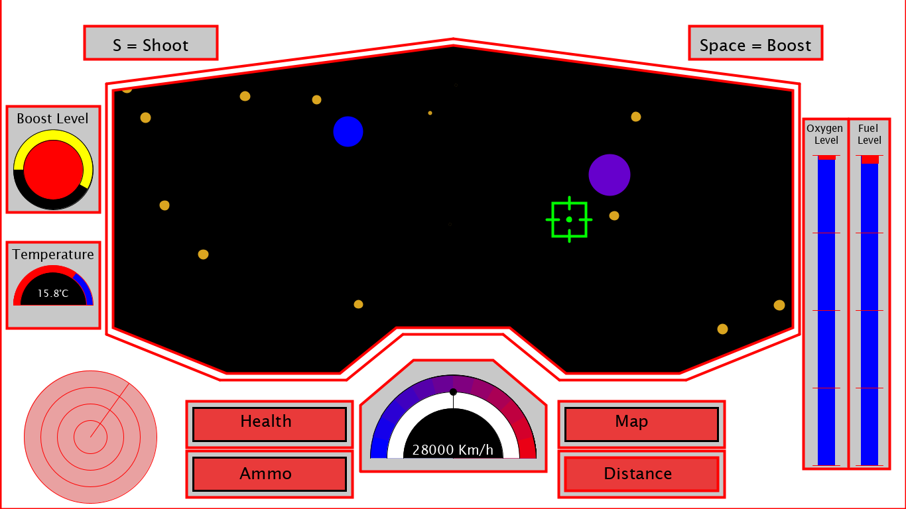
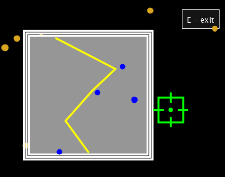
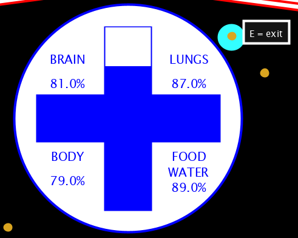
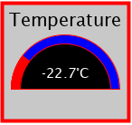
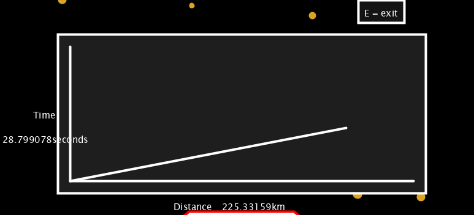
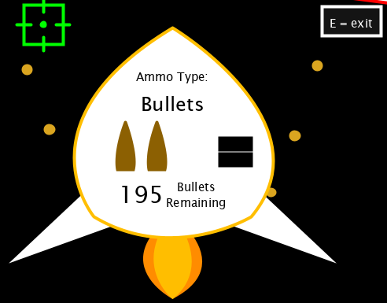
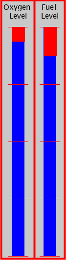
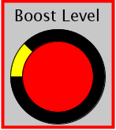
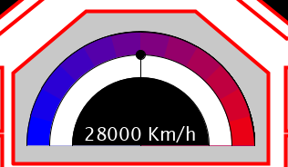
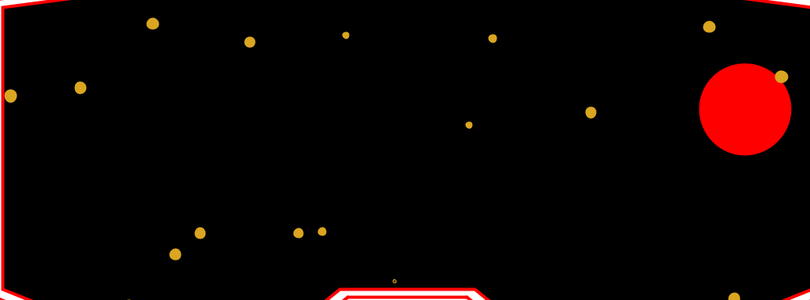

# SciFi UI Project

Name: Christopher Brady

Student Number: C17300916


# Description of the assignment

For this project we were given the task of creating a sci-fi inspired interface using java and processing. My User Interface was originally inspired by the idea of Iron Man. I wanted to create an interface that could be seen inside a helmet of some sort of flying suit through space. I started this project by designing the space in the background, this took a lot of time as I decided to use random variables for the colours of the planets and also initially the size. I decided to go for a simplisitic look with red and white being the dominant colours of the interface, red being a significant colour for Iron Man. Each object that appears on the interface of the helmet is surrounded by a red border to adhere to this design and adapt to a more modern look. The overall helmet design shows where the user can look out into space and the digital interface they will see also. A main part of my interface design was functionality as I wanted to allow the user to see how the interface actually worked through some interactivity with the speed, shooting and other key features of the ship. The final look of my interface is shown below but I will provide a link to a youtube video further down which will display the interface's interactivity and design more clearly.


# Instructions

### I added in some visual instructions to my system also but the *button* instructions for my system are as follows:

- *SPACE* ==> Applies boost to the UI, you should visually be able to see the stars / planets move faster, the fuel level should decrease faster, the boost level should also decrease, and the speedometer should increase to it's boost speed.

- *S*     ==> Allows the user to shoot a planet when the target is on it, you should see the planet dissapear and the bullet count decrease in Ammo.

- *e*     ==> Enables a user to exit a pressed button like map, you should see the map dissapear.

- *mouseClick* ==> on a button will open them and display different objects eg. a map

### Different Features that can be seen :

- Map: When the map button is clicked a map is generated with a random route ( in yellow ) from a stationary starting point and shows planets that it has to go by in blue which spawn in random spots and at random sizes. The purpose of the map is to show the user where they are travelling. Although each time the map button is pressed a different route is generated, the fact that the start point is stationary simulates the users progress as if the map changes as the user progresses.


- Health: This shows the overall health of the user in the system. The health automatically decreases over time in relation to four different properties: Brain ( *This goes down as the person is alone in space and his mental health would, in theory, decrease over time because of this sense of abandonement* ), Body ( *This goes down due to the assumption that being in space in just a metal suit will have a negative effect on your body* ), Lungs( *As the level of oxygen is very low and the change of atmospheric pressure is so prominent, I thought lungs would be an appropriate measure of health* ) and finally, Food & Water ( *This is an obvious health attribute as these levels are the most important for a humans health* ). These attributes decrease in tandem and are shown visually through a cross.

 
- Temperature: This feature tells the temperature of the suit. For this interface I decided to make it increment and decrement randomly and rapidly. My decision for this was to simulate the unpredictable temperatures in space where if close to a planet or stars it could be extremely warm and when in deep space it could be extremely cold. 


- Distance: This feature displays a distance, time graph and resets every time it is spawned. This is also affected by the boost as the distance increments faster whenever boost is used.


- Ammo: This button, when clicked, displays the amount of ammo the user has remaining. In this interface the user can shoot and destroy planets by pressing s, which decrements the amount of ammo simultaneously.


- Fuel and Oxygen: These two objects appear side by side in the system and allow the user to keep track of the amount of fuel and oxygen they have left. They both decrement over time, and if one runs out the interface ends. The fuel decreases faster and also reacts to when the boost is used as it runs down faster. These objects are the largest on the base screen of the interface and the reasoning behind this was the importance behind them and so the user could keep track.


- Boost: This fesature is one of the core objects of this system as it affects so many others when used. It appears on the left side of the interface and automatically fills itself and can be used at any time if SPACEBAR is pressed which decreases it. It acts as if it is charged by the system while running. Another cool feature is the fact that it highlights yellow when full.


- Speedometer: This feature can be seen at the bottom centre of the interface and keeps track of the speed the user is going. To come up with a rough average speed I did some research on spaceships and the speed they go which is where i came up with the steady travelling speed of 28000km/h. I was going to allow this to change but as I figured there would be no resistance from air or gravity in space, I allowed the speed to stay uniform unless the boost was pressed. If the boost is pressed the speedometer increments to 42000km/h, an increase of 50%.


- The Background (Stars and Planets): For the background which is set in space, I designed Planets and Stars which spawn and despawn automatically based on time passed. The stars spawn more frequent but don't increase in size as much as planets as they can be millions of kilometres away. I implemented them so they travel sideways across the screen to simulate the user going forward through space. Another feature of the stars is that they spawn in random Y positions accross the centre of the screen and travel diagonally in a direction relevant to this spawn position. The planets are similar in their movement but they travel at a faster base speed and increase in size quicker. Another cool feature of the planets, is that they spawn with different colours randomly from an array of colours which i created. Both of these objects are affected by the boost as their speed of movement increases across the screen when the boost is pressed, which also simulates the user moving faster.



# How it works
As I have mentioned before, I used a combination of java and processing to complete this project. The main body of my code is in UI.java as this is where all of the other classes I created are called from here. Every additional class is added to an array list of uiObjects. Although I struggled with the use and understanding of polymorphism at the star, I think this method was the most intuitive way of structuring and coding my project.

*Example of the arraylist i used*:
```Java
public ArrayList<UiObject> uiObjects = new ArrayList<UiObject>();
uiObjects.add(new Target(this, width / 2, height/2));
uiObjects.add(new Buttons(this, width/4, height - height/ 6));
uiObjects.add(new Temperature(this, 80, height - height / 2.5f));
uiObjects.add(new Boost(this, 80, height / 3));
uiObjects.add(new Radar(this, 1, width/10, height - height / 7, 100));
uiObjects.add(new Oxygen(this, width -120, height - 300));
uiObjects.add(new Fuel(this, width -55, height - 300));
uiObjects.add(new Speedometer(this, width/2, height * .9f, PI));
uiObjects.add(new Instructions(this, width/6, height/12));
uiObjects.add(new Helmet(this, width, height));
```

From this I also used inheritance as each class created inherited from the abstract class uiObjects.java. This was very helpful as the majority of the other classes I created used similar values or variables. Each class also inherited the render and update methods which added some uniform structure to my code Any drawing or initialising of an object I completed within the render method and any update or change to this drawing I added in update.


```Java
public class Fuel extends UiObject
{
    int size = 25;
    int half = 2;
    int qtr = 4;
    float y2 = 0.1f;
    float fdown = y-y/half;
    //distance to oxygen + 5
    float designX = 100;
    float designY = 5;

    public int fireRate;

    public Fuel(UI ui, float x, float y)
    {
        super(ui,0, x, y, 0, 0, 0);
    }
    
    public void render()
    {

        //outside design surrounding both oxygen and fuel
        ui.rectMode(PConstants.CORNER);
        ui.strokeWeight(4);
        ui.stroke(255,0,0);
        ui.fill(200);
        ui.rect(x -designX, fdown - size*2 -designY, designX + size + designY, y + designY*2 + size*2);
        ui.line(x -designX/3.2f, fdown - size*2 -designY, x -designX/3.2f, y+y/half+ half);


        //adding fuel heading
        ui.strokeWeight(1);
        ui.fill(0);
        ui.textSize(15);
        ui.text("Fuel ",x, fdown - size*1.7f);
        ui.text("Level", x, fdown - size);

        //fuel design ( 2 rectangles over one another)
        ui.pushMatrix();
        ui.stroke(0, 0, 255);
        ui.fill(0,0,255);
        ui.rectMode(PConstants.CENTER);
        ui.rect(x, y, size, y);
        ui.stroke(255, 0, 0);
        ui.rectMode(PConstants.CORNER);
        ui.fill(255,0,0);
        ui.rect(x - size/half, fdown, size, y2);
        
        //different points on the fuel
        ui.stroke(255,0,0);
        ui.line(x-size/1.2f, y - y/half , x + size/1.2f, y-y/half);
        ui.line(x-size/1.2f, y - y/qtr , x + size/1.2f, y-y/qtr);
        ui.line(x-size/1.2f,  y , x + size/1.2f, y);
        ui.line(x-size/1.2f, y + y/qtr , x + size/1.2f, y+y/qtr);
        ui.line(x-size/1.2f, y + y/half , x + size/1.2f, y+y/half);

        ui.popMatrix();
    }

    public void update()
    {
        
        if(ui.checkKey(' ')&& y2 < y){
            y2 =y2 + 0.05f;
        }
        else{
            if(y2 < y){
                y2 =y2 + 0.02f;
            }
            else{
                ui.exit();
            }
        }
    }
        
        
}
```
Above I have given an example of how a typical class that I created was implemented. In this example I set a lot of variables at the top of the Fuel.java, the reasoning of these was to avoid hard coding. Next, you can see the super class being called. In this example I only passed three variables ui, x and y. The ui variable allowed me to inherit all of the properties of the ui.java including PApplet, this is why a lot of my code includes ui. before it. In some cases, for constant variables such as PI, an error would occur as a static variable must be declared in a static way. In order to address this I imported a PConstants library and used constants like PConstants.PI which fixed the problem.

For the majority of the interactivity of my program, I used built in functions such as checkKey and mouseClicked. Although tricky to use at stages, I eventually got the hang of them and definitely have a greater understanding.
Overall the system works in tandem due to all classes being called by ui.java, this allowed me to control when certain things would be called and added a more simplistic layout for me to understand

# What I am most proud of in the assignment
The progress i made throughout this project was a very satisfying and rewarding accomplishment. I ensured from my very first commit back on the 27th of March that I continually and gradually made commits and changes to my project most days, which was a very beneficial way of doing the project. This method is something that I would not have done in the past but will definitely do in the future due to its many benefits such as taking the pressure off and allowing me see my progress over time. 

The main part of the project that I am proud of though, is the overall aesthetic and usabilty of the system I created. I was really happy in the success I had of allowing the user to boost, speed up or even shoot with the interface, and the connectivity that these functions had with other objects and classes through inheritance and polymorphism. This functionality adds a game aspect to my interface which I really enjoyed creating and has definitely inspired me to make more programs and even games like this. The improvement of my skill and understanding of java was very satisfactory also, as it allowed me to learn while enjoying the experience of making the interface.  


# Youtube Video


[](https://www.youtube.com/watch?v=Znx7I8AOQS4)


